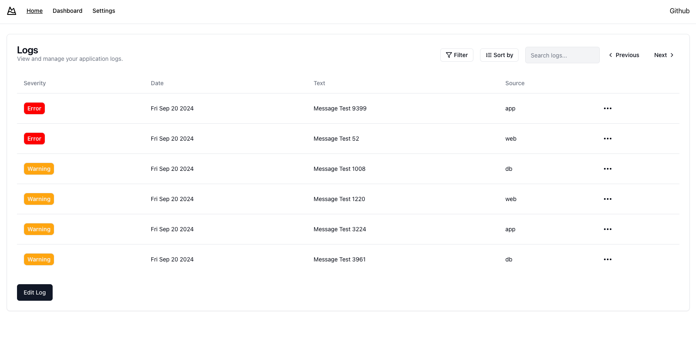
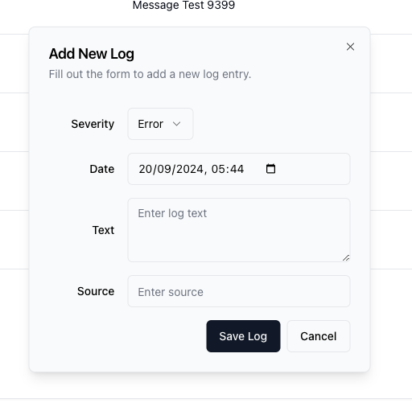
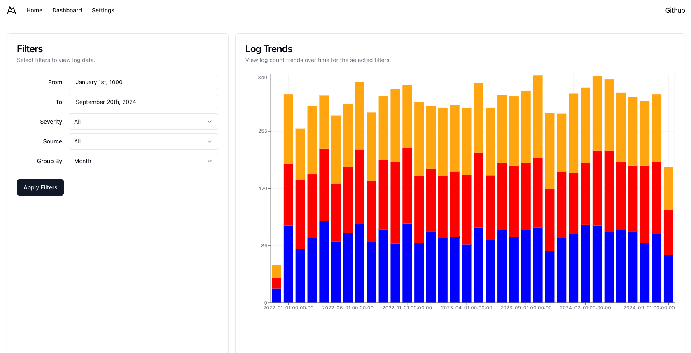
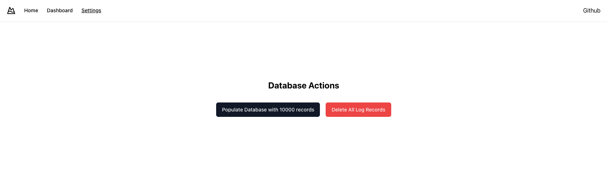

# LogsDashboard

> Important: Please go to the settings first to add some data to the database.

This project is a simple dashboard with: 
- Dashboard in Next.js
- API with fastAPI (Python)
- Database with SQLite

# Interface

## Home


Here, you can paginate, sort, filter, add edit and delete logs.



## Dash


Here, you can see a simple dashboard with some data, you can filter and change the aggregation.

## Settings



Here you can add some data to the database or delete all data.

## How to run

The easiest way to run this project is using docker-compose. Just run the following command:

```bash
docker compose up
```

Normally, the project will be available at `http://localhost:3000`.

If you have any problem with the docker-compose, you can run the following commands:

```bash
docker compose up --build
```

Or try to rerun it, there is the possibility that the database is not ready yet but will be ready in the next try.

```bash
docker compose up
```

This command will build the images and run the containers. The dashboard will be available at `http://localhost:3000`.

The API will be available at `http://localhost:8000`, all the endpoints are documented with Swagger: `http://localhost:8000/docs`.


## Comment about this project

This project was created to show a simple dashboard with some data. The data is generated randomly and stored in a SQLite database. The API is used to get the data from the database and the dashboard is used to show the data.

Some improvements that could be done:
- Remove all 'any' types from the code
- Add tests
- Rewrite some part of the API to use build in function directly from the database

## Final Thoughts

Building the Logs Dashboard has been a rewarding experience using NextJS, SQLite, and FastAPI. Here are some key points:

### Tech Stack Choices

- **NextJS**: Great for creating a fast and interactive frontend with features like server-side rendering.
- **SQLite**: A lightweight database that is easy to set up and works well for this project.
- **FastAPI**: Chosen for its speed and ease of use, making it simple to create a RESTful API.

### Future Enhancements

- Add user authentication for better security.
- Implement advanced analytics features for deeper insights into logs.
- Consider more robust database options as the project scales.
- Devide the backend, frontend and database in different server, not all in one.
- All the code optimization in the frontend. (remove all any types for example)

Overall, this project allowed me to effectively combine modern technologies to create a functional logs management system. I look forward to further improvements and learning opportunities!
